# Pantone Color Matching GUI Using RGB Color Sensor Data

> [!WARNING]
> **Dataset Format**
>
> This dataset uses a **semicolon (`;`)** as the CSV delimiter.  
> Do not replace it with a comma (`,`).
>
> **Dependency Requirements**
> 
>   *Python Dependencies*
> 
>     pyserial>=3.5 
>
>   *C++ Libraries*
> 
>     Adafruit TCS34725

## Abstract

This project presents a real-time Pantone color matching system developed using Arduino Mega 2560, Raspberry Pi 3 B, and a color sensor. The system acquires RGB data from physical objects through a sensor mounted on a pan-tilt mechanism and applies software calibration and preprocessing for more accurate color detection. The processed color data is compared with a CSV dataset containing approximate Pantone RGB values to determine the closest Pantone shade. A graphical user interface running on the Raspberry Pi displays both the detected color and the corresponding Pantone color together with their RGB values in real time. The developed system provides a portable and practical solution for color comparison, reproduction, and basic applications aimed at detecting manufacturing defects.

## Introduction

Pantone is a standardized color language used in various fields such as fashion, graphic design, and manufacturing, creating a specific color matching system to prevent production errors in products. Many colors are named under the Pantone label, and this label provides guidance on the ratio of dyes used in the colour mixture, the printing process, and its consistency. However, existing licensed Pantone color matching devices or color books are quite expensive. The aim of this project is to determine the nearest Pantone shade of an existing product’s color by reading RGB values (directly or converting a spectral data) from a color sensor, enabling accuracy in reproduction and detection of manufacturing defects then visualized in GUI.

### Image 1: Pantone Color Chart

  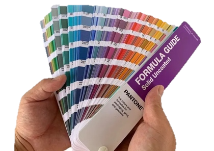

## Problem Statement

Raw RGB values provided by colour sensors often do not match real-world and vary depending on environmental conditions. Minor differences in the manufacturing process of colour sensors, or the fact red, green, or blue can differ by relative responsiveness from each other depending on different wavelengths, can seriously make colour measurements harder or may cause deflections. Reliable values require some software-based pre-processing and calibration using colour calibration cards. In addition, the original RGB values of Pantone colours are unknown due to licensing, so a CSV file should be created using approximate values.

### Image 2: Light Reflection

  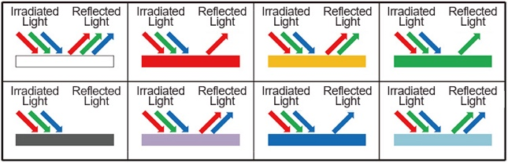

### Image 3: Colour Calibration Card

  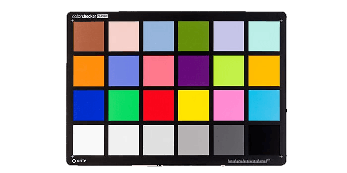

### Image 4: Physical Optical Filters under a TCS34-series Color Sensor (Llamas, 2018)

  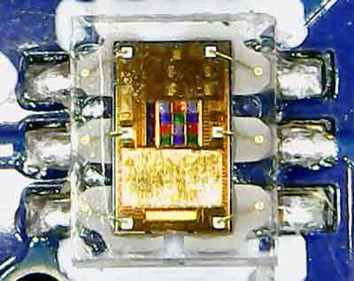

## Objectives

- To collect RGB data from colour sensor.
- To apply required software pre-processing to sensor data for calibration.
- To create a comparison algorithm for sensor data and Pantone shades.
- To visualize the colour that obtained from sensor data with the nearest Pantone shade on GUI.

### Image 5: Relative Responsivity x Wavelength (TCS 34725 Datasheet)

  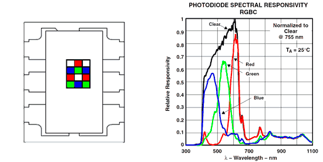

## Overview

| Component | Image |
|---|---|
| Jumper Cables | 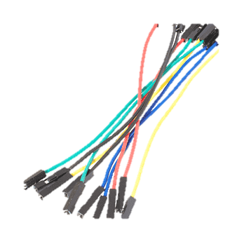 |
| Color Sensor | 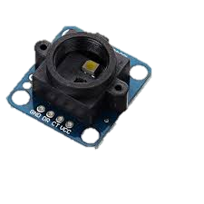 |
| Raspberry Pi 3 B | 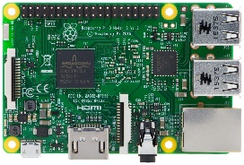 |
| Arduino Mega | 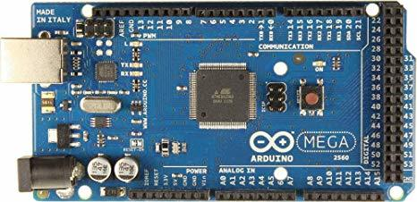 |
| Voltage Step Down Converter | 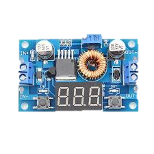 |
| Raspberry Pi Power Supply | 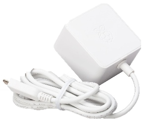 |
| Battery Holder | 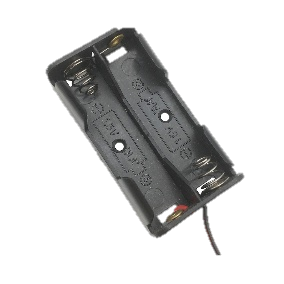 |
| 2 Mini Servo Motors | 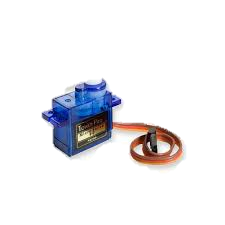 |
| Raspberry Pi Display 2 | 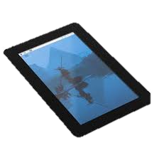 |
| Breadboard | 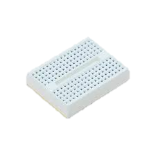 |
| Battery | 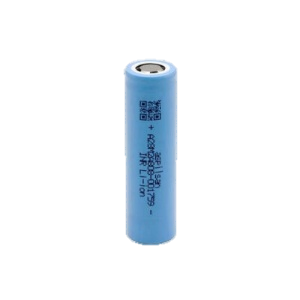 |
| Pan-tilt Mechanism | 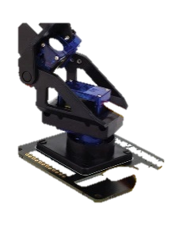 |

**Raspberry Pi 3 B:** Raspberry Pi is single-board computer that supports programming languages such as C/C++ and Python. It can interface with camera, sensors, displays and actuators.

**Arduino Mega:** Arduino Mega is a microcontroller board, it supports programming in C/C++ through the Arduino IDE.

**Color Sensor:** Electronic component that detects and measures by analyzing reflected light and converts it to digital color data form of RGB.

**Voltage Step Down Converter:** Electronic module that reduces higher voltage to a lower for safety of embedded system.

**Raspberry Pi Display 2:** Touch screen to use with Raspberry Pi computers.

**Pan-tilt Mechanism:** Mechanical system that allow a device to rotate horizontally (pan) and vertically (tilt) using servo motors.

**Servo Motors:** A Servo Motor is a small motor capable of moving to specific angles using control signals.

**Battery:** 18650 Battery is a rechargeable lithium-ion battery.

## Methodology

Note: The dataset uses semicolon (`;`) as the CSV delimiter.

### 1. System Desing Approach

1. RGB data is obtained by Arduino from the color sensor mounted on the pan-tilt mechanism.
2. Arduino performs pan-tilt control and apply software pre-processing to RGB data for calibration. The value measured from the color calibration cards is stored in Arduino’s EEPROM to be used as a reference for future measurements. Red, green, and blue values are adjusted through software weighting until the measured values match real-life colors. These parameters are stored as variables at the beginning of the code.
3. Arduino sends processed RGB values such as `128 3 65` to Raspberry Pi through serial communication.
4. A csv file containing a variety of Pantone color RGB values is loaded into Raspberry Pi.

  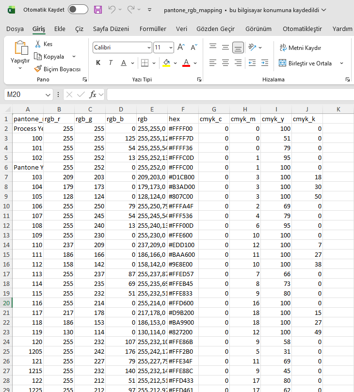

  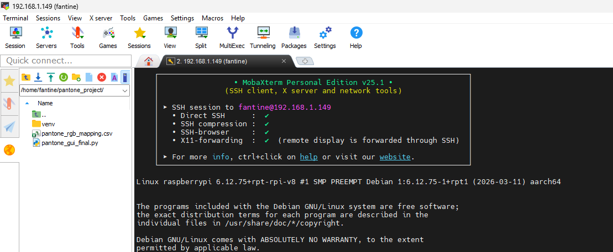

Raspberry Pi OS Lite is installed on Raspberry Pi, and the system boots using a connected microSD card. Code and csv files are loaded to Raspberry Pi through SSH connection. To make the Raspberry Pi behave like a kiosk system, the python application is launched automatically during boot using startup scripts, systemd services, or lightweight desktop session autostart configurations.

5. Raspberry Pi applies comparison algorithm with distance calculation to determine nearest Pantone shade.
6. Raspberry Pi displays the nearest Pantone shade match next to the measured color on the GUI, tkinter library was used for GUI application.

## Prototype Results

### Result: Pantone 7531 C

  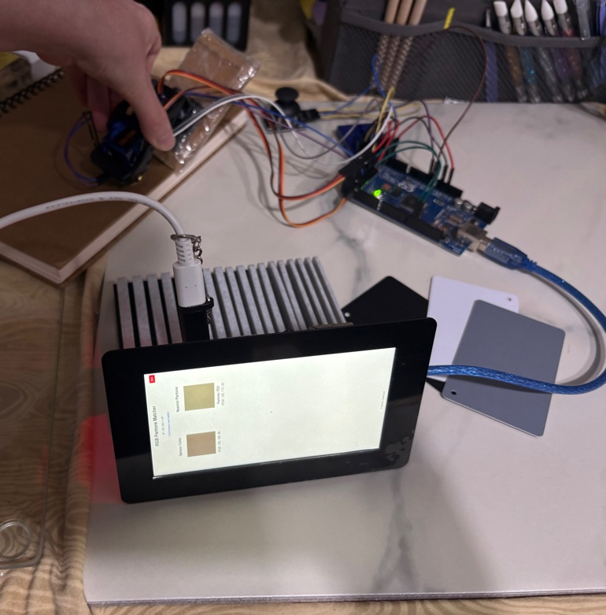
  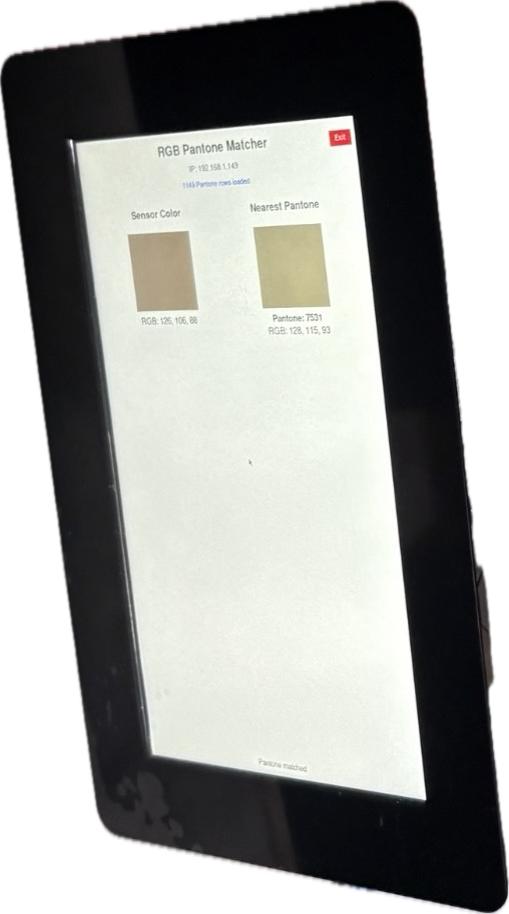

*Color calibration cards also can be seen in the picture above.*

### Result: Pantone 532 CP

  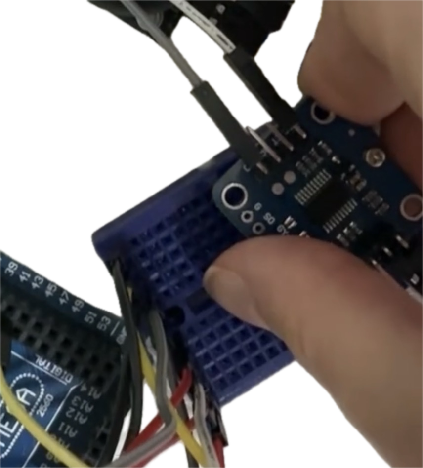
  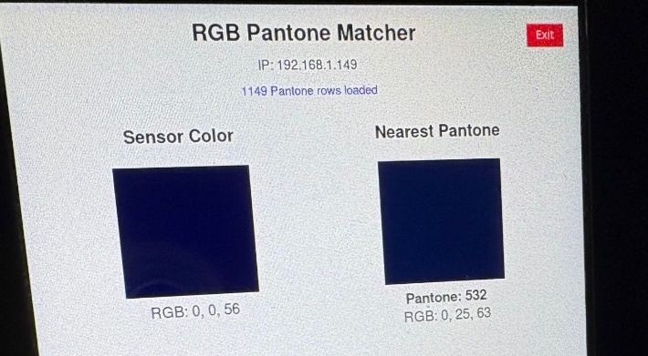

### Result: Pantone 481 C

  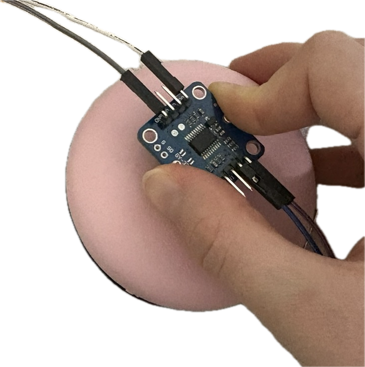
  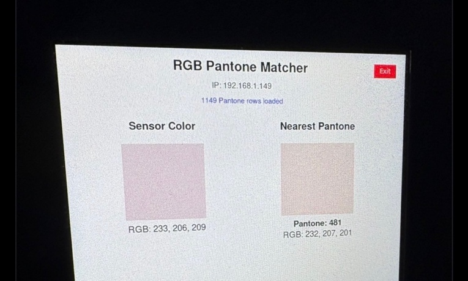

## 2. Hardware Components

- Arduino Mega 2560
- Raspberry Pi 3 Model B & Raspberry Pi Touch Display 2
- TCS34725 color sensor (AS7341 in later stages)
- Two Mini Servo Motors, Pan-Tilt Mechanism & Joystick Module
- Breadboard & Jumper Wires
- 5.1V 3A Power Supply & USB Cables
- Two 18650 Li-ion Batteries, Battery Holder & XL4015 Step-Down Converter

## Expected Results

The system is expected to process and transfer real-time data and display reliable comparison results on the GUI. It should display relevant Pantone shade name & RGB values of both colors.

## Conclusion

The system proposes a lower-cost and real-time color matching device for Pantone colors. Prototype results show its feasibility and further improvements expected to enhance its quality & accuracy. The TCS34725 color sensor may be replaced with the AS7341 10-Channel Light / Color Sensor to achieve higher spectral resolution and more accurate color analysis in the later stages of the project.

## References
- Llamas, L. (2018, January 16). *Measure RGB values with Arduino and TCS34725 color sensor*. Luis Llamas. https://www.luisllamas.es/en/arduino-rgb-color-sensor-tcs34725/
- Adafruit, TCS34725 Datasheet: https://cdn-shop.adafruit.com/datasheets/TCS34725.pdf
